# __Introduction to Computer System [ICS]__

# __Contents__
* [เลขฐาน](#เลขฐาน)
* [Computer System](#Computer-System)
* [Digital System](#Digital-System)
* [ฝึกอ่าน](#ฝึกอ่าน)

# __เลขฐาน__
    เลขฐาน หมายถึง กลุ่มข้อมูลที่มีจำนวนหลัก (Digit) ตามชื่อของเลขฐานนั้น ๆ เช่น เลขฐานสอง เลขฐานแปด เลขฐานสิบหรือเลขฐานสิบหก เป็นต้น

## **การแปลงเลขฐาน 10 เป็น ฐาน 2**
1. ใช้วิธีหารสั้นด้วยเลข 2
2. หารไปเรื่อยๆ จนกระทั่งไม่สามารถหารต่อได้
3. นำเศษที่ได้มาเขียนลำดับจากล่างขึ้นบน

## **การแปลงเลขฐาน 2 เป็น ฐาน 10**
* [การกระจาย](#การกระจาย)
* [ใช้การคูณด้วยฐานของตัวเลข](#ใช้การคูณด้วยฐานของตัวเลข)

# การกระจาย
1. กระจายเลขฐาน 2 จากโจทย์โดยกระจายตัวเลขจากซ้ายไปขวา
2. นำเลขฐาน 2 ที่กระจายแล้วในแต่ละหลักคูณกับค่าประจำหลักในแต่ละตำแหน่งคือ 2nโดยเริ่มนับค่าประจำหลักจากด้านขวามือสุดเป็นตำแหน่งที่ n=0
3. นำผลลัพธ์จากการคูณของแต่ละหลักมาบวกกันจะได้เป็นค่าของเลขฐาน 10

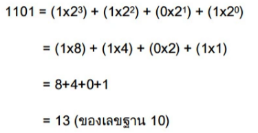

# ใช้การคูณด้วยฐานของตัวเลข
1. นำตัวเลขหลักแรกทางซ้ายมือมาคูณด้วยฐานของตัวเลขคือ 2 แล้วบวกกับตัวเลขหลักที่สอง
2. นำผลบวกที่ได้จากข้อก่อนหน้านี้มาคูณด้วย 2 และบวกกับตัวเลขหลักถัดไป (หลักที่สาม, สี่, ห้า,...)
3. ทำโดยใช้หลักการเดียวกับข้อ 2 ไปเรื่อยๆ จนถึงตัวเลขหลักสุดท้าย

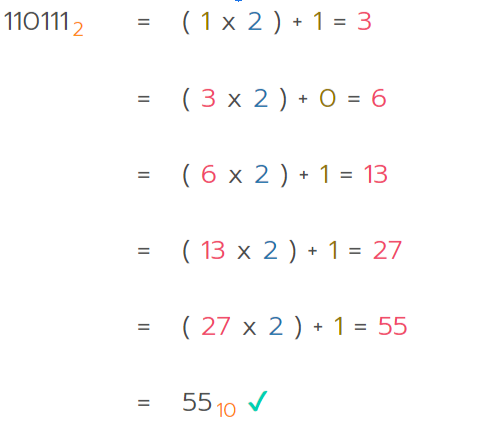

# __Computer-System__
## ***Analog***
ระบบนี้มีลักษณะสำคัญคือ ระดับค่าของ Input และ Output จะมีการรับค่า ที่ไม่จำกัด และเป็นแบบ ต่อเนื่อง เช่น ***สายสัญญาณมือถือ สัญญาณวิทยุ***

## ***Digital***
ระบบนี้มีลักษณะสำคัญคือ ระดับค่าของ Input และ Output จะมีการรับค่า จำกัด และเป็นแบบ ไม่ต่อเนื่อง เช่น ***VCD/DVD  E-Book***

# __Digital-System__
1. __ตาราง Truth Table__

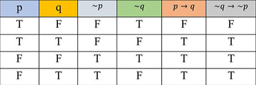

2. __ประโยคสัญลักษณ์ Boolean Expression__
   
   คือชนิดข้อมูลแบบตรรกะเป็น ชนิดข้อมูลแบบหนึ่งสามารถเก็บค่าได้เพียง 2 ค่าคือ 1 หรือ 0 ซึ่งสามารถแทนค่าได้เป็นจริง หรือเท็จ ตามลำดับ

3. __ผังการเชื่อมต่อของ Logic gate__

   ___Logic Gate___ เป็นตัวดำเนินการทางตรรกศาสตร์โดยจะรับ input เป็น bit __1__ หรือ __0__ แทนค่าเป็น **True** และ **False** และจะนำไปประมวลผลเพื่อประกอบเป็นวงจรตรรกะซึ่งเป็นวงจรดิจิตัลประเภทหนึ่งโดยเกทพื้นฐานจะมีอยู่ 7 แบบ ได้แก่

# ***1. AND Gate***
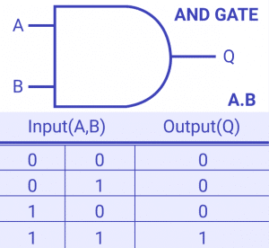
# ***2. OR Gate***
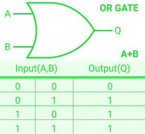
# ***3. NOT Gate***
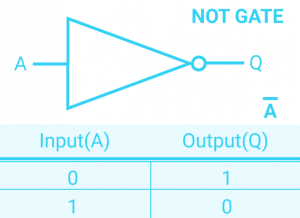
# ***4. NAND Gate***
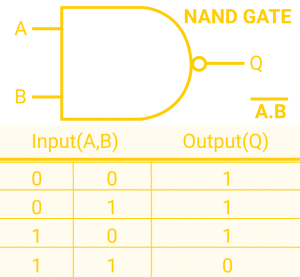
# ***5. NOR Gate***
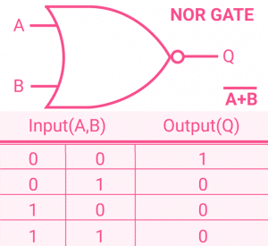
# ***6. XOR Gate***
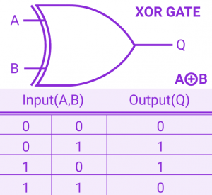
# ***7. XNOR Gate***
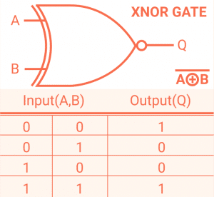

# __ฝึกอ่าน__
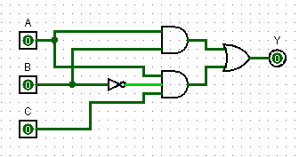

__(A • B)+ C__

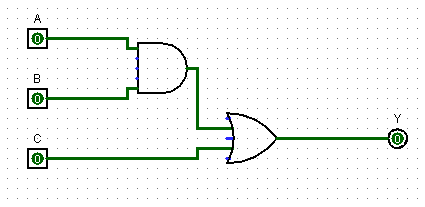

__AB + A(Not B)C__
